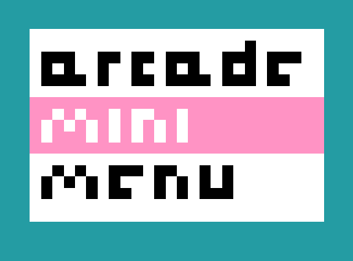

# arcade-mini-menu

This is an extension for [Microsoft MakeCode Arcade](https://arcade.makecode.com/) that allows you to create menus for your arcade game!

Some of its features include:

1. Menus that can be used as sprites (with all the blocks in the Sprites category)
2. Support for both text and icons
3. Automatic scrolling when space is limited
4. Flexible menu layouts including single-column, single-row, and an x-y grid
5. A wide range of menu style options to match the look and feel of your game

## Examples

### Simple pause menu

https://makecode.com/_321Ui6hwb8oK

###

## Add this Extension to a new project

This repository can be added as an **extension** in MakeCode.

* open [https://arcade.makecode.com/](https://arcade.makecode.com/)
* click on **New Project**
* click on **Extensions** under the gearwheel menu
* search for **https://github.com/riknoll/arcade-mini-menu** and import

## Edit this project

To edit this repository in MakeCode.

* open [https://arcade.makecode.com/](https://arcade.makecode.com/)
* click on **Import** then click on **Import URL**
* paste **https://github.com/riknoll/arcade-mini-menu** and click import

#### Metadata (used for search, rendering)

* for PXT/arcade
